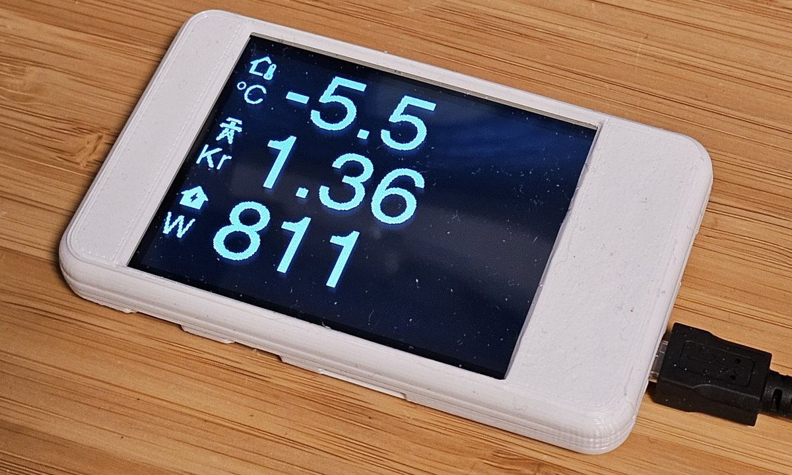
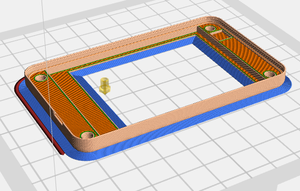

# Esphome CYD Display
This is the Esphome yaml code for a display I use with Home Assistant. It displays outdoor temperature with a graph and by touching the display is will show electricty price and consumtion for 5 seconds.

\

### Parts
Use this arfilliate link to support me!\
[ESP32-2432S028R aka ESP CYD ](https://s.click.aliexpress.com/e/_c3YeJZvD)

### 3D Printed Case for CYD
Files:\
[Top](./case/CYD_Case_Top.stl)\
[Bottom](./case/CYD_Case_Bottom.stl)

If you have a printer without a heated bed it will likely wrap and the corners will lift and detach from the bed. This can be prevent by adding a Brim.\
 

